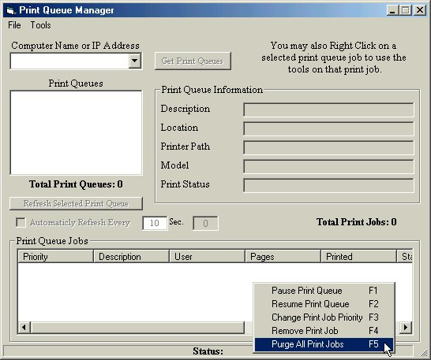



## Print Queue Manager

### Description

You will need to have ADSI 2.5 installed on both the local and remote computer. This is free from Microsoft. With this program there are MANY useful tools. (See PIC) This is for Windows NT and Windows 2000 All Versions. You must have rights to the printers in order to modify the print queue. PLEASE VOTE!!!
 
### More Info
 

             |
---                |---
**Submitted On**   |2000-12-02 00:29:18
**By**             |[Shane Croft](https://github.com/Planet-Source-Code/PSCIndex/blob/master/ByAuthor/shane-croft.md)
**Level**          |Advanced
**User Rating**    |4.8 (82 globes from 17 users)
**Compatibility**  |VB 6\.0
**Category**       |[Complete Applications](https://github.com/Planet-Source-Code/PSCIndex/blob/master/ByCategory/complete-applications__1-27.md)
**World**          |[Visual Basic](https://github.com/Planet-Source-Code/PSCIndex/blob/master/ByWorld/visual-basic.md)
**Archive File**   |[CODE\_UPLOAD122551222000\.zip](https://github.com/Planet-Source-Code/shane-croft-print-queue-manager__1-13259/archive/master.zip)

